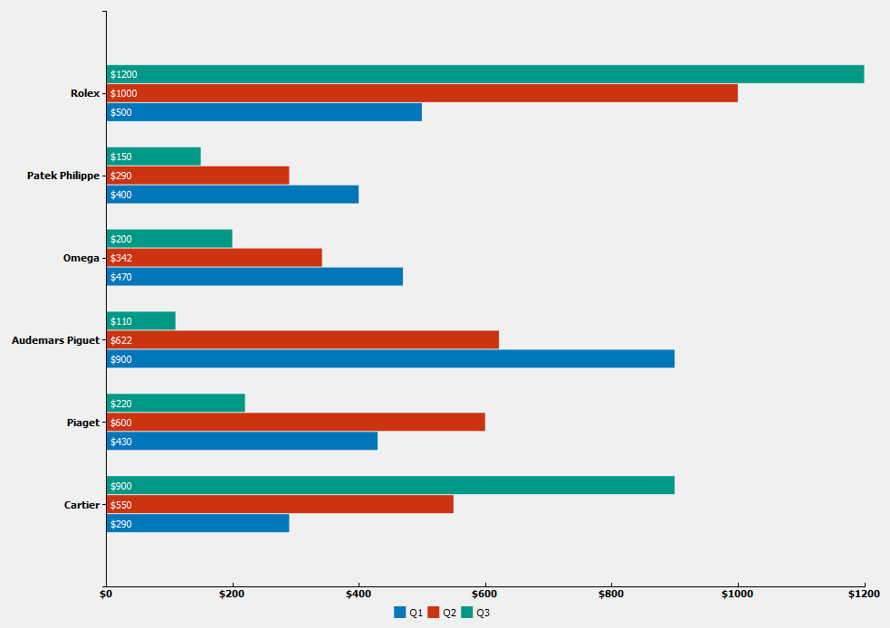
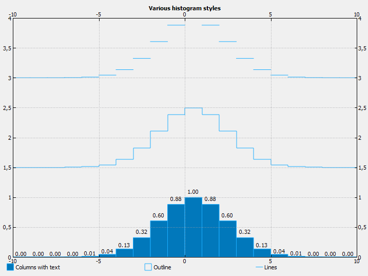
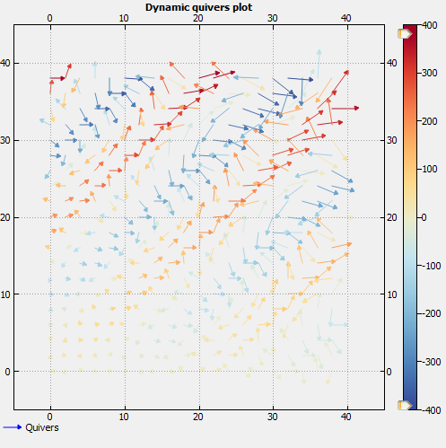
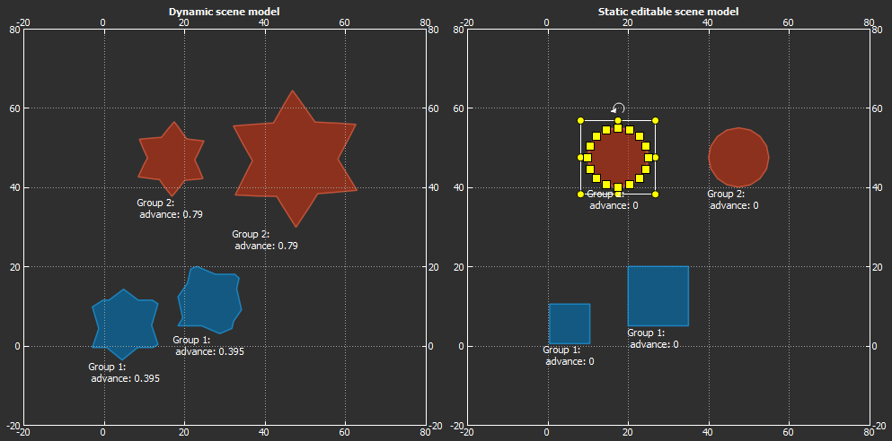

# Gallery

This page presents examples of plots made with the *Plotting* library and link the associated source code.

## Axes

This example shows how to organize several axes around the same plotting are and what type of axis optinos are available. [Source code](../src/Tests/Plotting/Axes/main.cpp).

## BarChart

This example demonstrate how to quickly create a bar chart. [Source code](../src/Tests/Plotting/BarChart/main.cpp).

## CurveStreaming

This application shows 6 curves streaming continuously and different ways to manage the time scale. [Source code](../src/Tests/Plotting/CurveStreaming/main.cpp).

## CurveStreaming2

This application shows another example of continuously updated curves. It displays 100 curves of 10000 points each updated at around 100Hz. [Source code](../src/Tests/Plotting/CurveStreaming2/main.cpp).

## CurveStyles

Shows the different styles and symbols used to render curves. [Source code](../src/Tests/Plotting/CurveStyles/main.cpp).

## HeavyCurveStreaming

Another example of curve streaming. This one demonstrate the rendering capabilities, as it displays around 30M points per second with a display rate of 60Hz.
It also uses a custom style sheet to modify the plotting style. [Source code](../src/Tests/Plotting/HeavyCurveStreaming/main.cpp).

## HistogramStyles

This example displays the different histogram styles. [Source code](../src/Tests/Plotting/HistogramStyles/main.cpp).

## PieChart

An example of quickly setup pie chart. [Source code](../src/Tests/Plotting/PieChart/main.cpp).

## PolarGauge

This example demonstrate the usage of a live VipPolarValueGauge widget. 
At first, this widget was developped for internal use only, but it became a good way to demonstrate how to build a custom widget using existing plot items.
VipPolarValueGauge uses several VipPieItem to build a customized polar gauge. [Source code](../src/Tests/Plotting/PolarGauge/main.cpp).

## Quiver

This example shows how to setup a live quiver plot which uses a colormap. [Source code](../src/Tests/Plotting/Quiver/main.cpp).

## Scatter

This example shows how to setup a scatter plot and the different scatter plot styles. [Source code](../src/Tests/Plotting/Scatter/main.cpp).

## SceneModel

This example shows how to plot scene models (type VipSceneModel). The left panel displays a live scene model based on polygon interpolation.
The right panel displays a "static" scene model which can be modified (move/resize/rotate shapes) with the mouse. [Source code](../src/Tests/Plotting/SceneModel/main.cpp).

## StreamingCurvePipeline

This example shows how to perform curve streaming with the use of the Agent library provided in the [Core](core.md) library. [Source code](../src/Tests/Gui/StreamingCurvePipeline/main.cpp).

## StreamingCurvePipeline

This example shows how to perform curve streaming with the use of the Agent library provided in the [Core](core.md) library. [Source code](../src/Tests/Gui/StreamingCurvePipeline/main.cpp).
